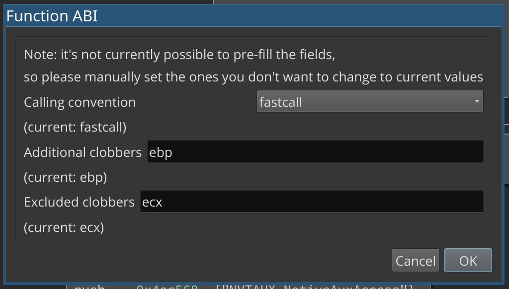

# Binary Ninja Function ABI plugin

The Function ABI plugin provides a GUI for adjusting the ABI in a fine-grained way. Right now, calling convention and clobbered registers can be adjusted.

## Motivation

Sometimes, Binary Ninja's analysis infers too many clobbered registers; if ebp is inferred as clobbered, this breaks analysis in callers. Occasionally it may also be useful to remove a register described by the calling convention as clobbered from the clobbered register set to remove false dependencies.

## License

[0-clause BSD](LICENSE-0BSD.txt)
